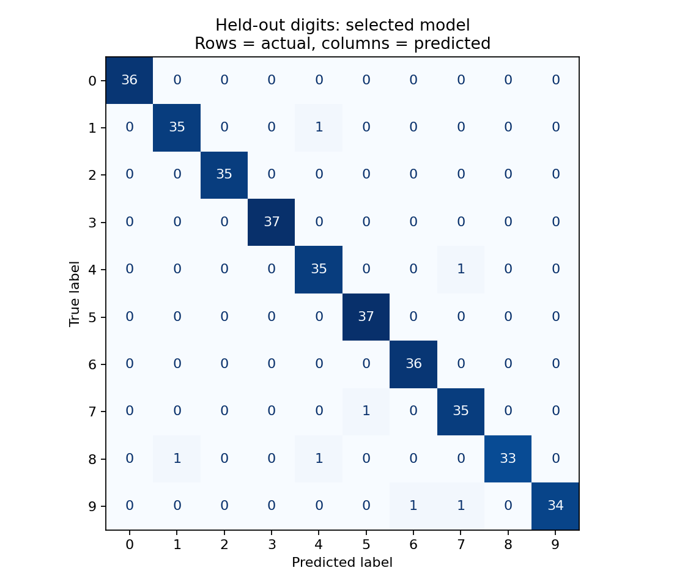

# Handwritten digit classifier

This project compares logistic regression and an SVM on scikit-learn's digits dataset. It includes a training command, a prediction command, tests, and the results of the first run.

The main question is whether the extra complexity of an SVM improves on a simpler model. Both models use the same split and preprocessing, and model selection happens before looking at the test scores.

## Run it

Use Python 3.12. Package versions are pinned in `requirements.txt`.

```bash
git clone https://github.com/kasimomar/digits-classifier-ml.git
cd digits-classifier-ml
python3.12 -m venv .venv
source .venv/bin/activate
python -m pip install -r requirements.txt
python -m pytest -q
python -m digits_ml train --output-dir artifacts
python -m digits_ml predict --model artifacts/model.joblib --input examples/digit.json
```

On Windows, activate the environment with `.venv\Scripts\activate`.

Training writes the model, metrics, confusion matrix, and a sample input to `artifacts/`. The example prediction is `{"predictions": [5]}`. That example comes from the test split; it checks that the CLI works and isn't a separate evaluation.

The dataset comes with scikit-learn, so training doesn't need an API key or a separate download. Only load `.joblib` files you trust: they use pickle serialization, which can execute code.

## Results

The seed-42 run uses 1,437 training examples and 360 test examples.

| Model | Training CV macro F1 | Test accuracy | Test macro F1 |
| --- | ---: | ---: | ---: |
| Most-frequent baseline | — | 10.00% | 0.0182 |
| Logistic regression | 0.9679 | — | — |
| RBF SVM | 0.9812 | 98.06% | 0.9805 |

The SVM was selected from the cross-validation scores and classified 353 of the 360 test images correctly. Logistic regression wasn't evaluated on the test set after selection.



[metrics.json](reports/metrics.json) contains the fold scores, per-class results, seven errors, exact split indices, and library versions. The [model card](reports/model-card.md) discusses the results and limitations in more detail.

## How training works

1. Make a stratified 80/20 split with a fixed seed.
2. Compare two pipelines using five-fold cross-validation on the training set. Each pipeline fits its own `StandardScaler` inside each fold.
3. Select the model with the highest mean macro F1, which weights each digit class equally.
4. Fit that pipeline on the full training set, then evaluate it on the held-out test set alongside a most-frequent baseline.
5. Save the fitted pipeline so prediction uses the same preprocessing.

The candidates use fixed settings: logistic regression and an RBF SVM with `C=3` and `gamma="scale"`. This is a small model comparison, not a broad parameter search. Results can vary slightly across platforms even with the same package versions.

## Prediction input

Input is a JSON array of rows. Each row represents an 8×8 grayscale image flattened in row-major order, with 64 pixel values from 0 to 16. The CLI checks the shape, range, and finite values.

It doesn't accept PNGs, photographs, or 0–255 images directly. Those would need a separate preprocessing step with its own tests.

## Where to look

- [model.py](digits_ml/model.py): data split, pipelines, evaluation, and input checks
- [__main__.py](digits_ml/__main__.py): training and prediction commands
- [tests](tests/test_model.py): split isolation, input checks, scaler fitting, and model reloads
- [reports](reports): saved results and model card

GitHub Actions runs the tests, trains the models, checks example inference, and uploads the report. The fixed benchmark has a macro-F1 regression check of 0.90; that threshold doesn't say anything about performance on new kinds of images.

## Data and next steps

The [digits dataset](https://scikit-learn.org/stable/modules/generated/sklearn.datasets.load_digits.html) contains 1,797 images across ten classes and is derived from UCI's optical-recognition dataset. It's a useful small benchmark, but it doesn't represent camera photos or general document OCR.

The split is by image, not by writer. Testing on separate writers and an external dataset would be the next useful evaluation. Any changes prompted by the seven test errors should use a new evaluation partition rather than repeatedly tuning against this one. Image-file preprocessing, latency measurements, calibration, and an abstention rule would also be needed before building a service.
