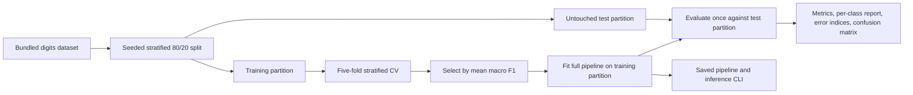

# Handwritten Digits — Reproducible ML Benchmark

A Python machine-learning project that classifies 8×8 grayscale digit images and makes the evaluation easy to audit. It compares a simple baseline with two preprocessing/model pipelines, selects a model using training-only cross-validation, and evaluates the selected model on a held-out test set.

**Focus:** reliable ML engineering, explicit evaluation boundaries, reproducible artifacts, and usable inference—not a claim of production OCR performance.

## Results

Seed 42; 1,437 training examples and 360 held-out examples:

| Model | Training CV macro F1 (mean ± fold SD) | Held-out accuracy | Held-out macro F1 |
| --- | ---: | ---: | ---: |
| Most-frequent baseline | — | 10.00% | 0.0182 |
| StandardScaler → logistic regression | 0.9679 ± 0.0073 | Not evaluated | Not evaluated |
| StandardScaler → RBF SVM, selected by CV | 0.9812 ± 0.0051 | **98.06%** | **0.9805** |

The selected model correctly classifies **353 of 360** held-out examples. CV fold standard deviation is descriptive variation, not a confidence interval. See [full metrics, split indices, and errors](reports/metrics.json) and the [model card](reports/model-card.md).


## Quick start

Use Python 3.12. Dependencies, including transitive dependencies, are pinned in `requirements.txt`.

```bash
git clone https://github.com/kasimomar/digits-classifier-ml.git
cd digits-classifier-ml
python3.12 -m venv .venv
source .venv/bin/activate
python -m pip install -r requirements.txt
python -m pytest -q
python -m digits_ml train --output-dir artifacts
python -m digits_ml predict --model artifacts/model.joblib --input examples/digit.json
```

On Windows, activate with `.venv\Scripts\activate`. The example command returns `{"predictions": [5]}` for the committed example from the held-out partition. It demonstrates inference plumbing, not an additional independent evaluation.

Training writes a model, JSON metrics, confusion matrix, and example input to `artifacts/`. Model files and generated scratch outputs are ignored by Git; the small reference report is committed separately. The dataset ships with scikit-learn, so training requires no external data service once dependencies are installed.

## Evaluation design



- Candidate settings are fixed in source: logistic regression and RBF SVM (`C=3`, `gamma="scale"`). This is a two-model comparison, not an exhaustive hyperparameter search.
- Scaling happens inside each pipeline, so each CV fold learns its own preprocessing from its training rows.
- The selected pipeline is fitted only on the training partition. Test scores never choose the model.
- Macro F1 gives every digit class equal weight. Accuracy and per-class precision/recall/F1 provide additional context.
- Seeds, library versions, and exact train/test indices are included in the report. Small numerical differences across platforms remain possible.

## Input contract

The inference CLI accepts a JSON array of rows. Each row must contain **64 finite numbers in [0,16]**, flattened in row-major order from an 8×8 grayscale image. Shape, missing/non-numeric values, infinities, and out-of-range values are rejected. A raw photo, PNG, or 0–255 image is not accepted without a separate preprocessing pipeline.

Only load a trusted, locally trained `.joblib` model. Joblib uses pickle serialization and untrusted model files can execute code.

## Project structure

```text
digits_ml/model.py       Splitting, pipelines, selection, evaluation, input validation
digits_ml/__main__.py    Training and prediction CLI
tests/test_model.py      Split, input, preprocessing, persistence, and quality checks
examples/digit.json      A valid inference example
reports/                 Reference metrics, confusion matrix, and model card
.github/workflows/       Tests, training, inference smoke check, report artifacts
```

## Data and limitations

The [scikit-learn digits dataset](https://scikit-learn.org/stable/modules/generated/sklearn.datasets.load_digits.html) contains 1,797 small images across ten digit classes, derived from UCI's optical-recognition dataset. Pixel values range from 0 to 16. See the dataset documentation for provenance and references.

This is a small, established educational benchmark. A random stratified image split does not establish generalization to new writers, camera photos, different lighting, or real-world documents. Writer-group holdout is not implemented. No external dataset, deployment, calibration, or monitoring is included. The next meaningful evaluation would use a separate dataset with a clearly defined input distribution and writer-aware splitting where identifiers are available.

## Next improvements

- Add tests on a genuinely separate handwriting dataset and track domain shift.
- Inspect the misclassified images, then test any changes on a new evaluation partition rather than repeatedly tuning on this holdout.
- Add a versioned input-preprocessing contract for image files.
- Benchmark latency, model size, calibration, and an abstention policy before considering a service.

Development follows issues → branches → pull requests. CI runs the tests, trains from scratch, exercises prediction, and uploads the evaluation report. The tests include a generous >0.90 macro-F1 regression guard for the fixed benchmark, not a promise about new data.

Implementation reference: [scikit-learn guidance on avoiding data leakage](https://scikit-learn.org/stable/common_pitfalls.html#data-leakage).
